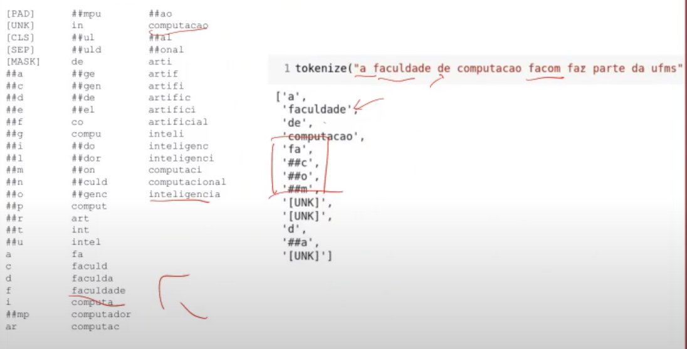

# Lista de exercícios 2

## 1. Explique as diferenças entre Redes convolucionais e Redes profundas

Uma **rede neural profunda** é caracterizada apenas pela presença de diversas camadas escondidas entre as camadas de entrada e saída.

Em uma **rede convolucional** a informação passa por filtros, com a intenção de acentuar e extrair características.

[fonte](https://iaexpert.academy/2020/06/08/os-tipos-de-redes-neurais/)

## 2. Explique relação entre a extração automática de características e deep learning

Deep learning faz extração automática de característica, enquanto que antigamente eram utilizadas técnicas de visão computacional.

## 3. Explique como transformar validação cruzada em leave-one-out

O leave-one-out é uma instância específica da validação cruzada, onde o número de partições é igual ao número de exemplos.

[fonte](https://youtu.be/4j95MhDenHE?t=3645)

## 4. O que reflete melhor o desempenho do algoritmo em produção o erro no conjunto de validação ou no conjunto de teste?

O erro no conjunto de teste.
Durante o treinamento, o conjunto de validação é utilizado repetidas vezes para medir o erro do algoritmo. Já o conjunto de teste nunca foi visto pelo algoritmo, ou seja, os dados são novos, o que o torna mais próximo dos exemplos que serão utilizados em produção (ou o torna mais afastado dos exemplos já utilizados para treinamento / validação)

[fonte](https://youtu.be/4j95MhDenHE?t=4198)

## 5. Quando o pré-processamento deve ser realizado depois da separação de treino e teste

Quando informação da classe é utilizada no pré processamento, tem que fazer a separação antes, e fazer o pré processamento apenas no conjunto de treino.

## 6. Qual é o perigo de utilizarmos o resultado da validação como resultado do modelo

O conjunto de validação é utilizado várias vezes pelo modelo para medir o erro. Dessa forma, o modelo tenta ser o mais certeiro possível apenas com relação ao conjunto de validação. Isso se assemelha a "ver a resposta" antes de "responder a uma pergunta".

O ideal, é utilizar um outro conjunto disjunto do treino, e da validação, de forma que esses dados nunca tenham sido utilizados pelo modelo, seja para treinamento, seja para validação.

O resultado de validação costuma ser superestimado, o que pode levar a conclusões erradas, visto que o fine-tunning é realizado utilizando o conjunto de validação.

[fonte](https://youtu.be/4j95MhDenHE?t=4198)

## 7. Explique como fazer validação cruzada interna (nested cross-validation)

A validação cruzada interna é utilizada principalmente para ajuste de hiper parâmetros (learning rate, beta, alpha, entre outros).

Para executar a validação cruzada, são necessários 2 loops:

- O externo, para verificar a qualidade do modelo.
- O interno, para realizar a seleção de parâmetros, e do modelo.

A Cada iteração do loop externo, o melhor modelo encontrado pelo loop
interno será testado utilizando o conjunto de teste da partição externa (ou seja, este conjunto não foi visto pelo modelo).
Ao final, haverão k estimativas (onde k é o numero de partições), e basta utilizar alguma métrica como a média para verificar qual modelo possui melhor desempenho.

[fonte](https://www.analyticsvidhya.com/blog/2021/03/a-step-by-step-guide-to-nested-cross-validation/)

## 8. O que é o bias correction utilizado nos otimizadores

O bias correction faz com que valores iniciais da série tenham mais importância que os próximos.

[fonte](https://youtu.be/GhhnBNCUDtA?t=1410)

## 9. Qual é a relação entre Adam, momentum e RMSProp? Explique apresentando as equações do Adam

- Momentum: suaviza o gradiente utilizando média móvel exponencial.
- RMSProp: combinação entre o AdaGrad e Momentum, aplicando Momentum no AdaGrad.
- Adam: combinação entre RMSProp e Momentum, aplicando Momentum na loss.

Fórmula:

$W_{t+1} = W_t - \frac{\alpha}{\sqrt{S_t + \epsilon}} \times V_t$

$V_t = \beta_1 V_{t-1} + (1 - \beta_1) \times LOSS$ (Momentum)

$S_t =\beta_2 S_{t-1} + (1 - \beta_2) \times LOSS^2$ (RMSProp)

$\hat{V} = \frac{V_t}{(1 - \beta_1)^2}$ (Bias correction)

$\hat{S} = \frac{S_t}{(1 - \beta_2)^2}$ (Bias correction)

## 10. Qual é o efeito do Weight decay na atualização de pesos dos algoritimos

É um mecanismo para combater o modelo de aumentar sua complexidade. É adicionado um parâmetro na loss, chamado de parâmetro de regularização, sendo este proporcional ao tamanho / complexidade do modelo. Além disso, acompanha um hiper parâmetro $\lambda$ (lambda) que controla o quanto o modelo deve considerar sua complexidade. É equivalente ao learning rate para a loss comum. Com isso, diminui o valor dos pesos.

[fonte](https://youtu.be/GhhnBNCUDtA?t=4256). Voltar um pouco no vídeo.

## 11. Qual é o problema de utilizar função logística como função de ativação

A função satura muito rapidamente, ou seja, possui resultados muito próximos mesmo quando as entradas possuem valores distantes. Outro problema é a propagação de desativação de camadas, visto que seu intervalo varia entre $[0, 1]$.

[fonte saturação](https://youtu.be/glPd3bpqU2U?t=221)

[fonte propagação](https://youtu.be/glPd3bpqU2U?t=350)

## 12. Explique porque não é necessário aplicar softmax na última camada da rede antes de calcular cross-entropy

Pois a cross-entropy já aplica softmax internamente.

[fonte](https://youtu.be/glPd3bpqU2U?t=1803)

## 13. Considere um problema de análise de sentimento com as classes positivo, neutro e negativo

### 13.1 Como deve ser o setup da última camada da rede ao utilizar cross-entropy como função de perda

A última camada deve conter 3 neurônios, visto que existem 3 saídas (positivo, neutro, e negativo).

### 13.2 Conside um exemplo da classe positiva, e uma que rede produz como saída os valores `[0.5, 0, 1]` Qual é o valor da cross-entropy este caso

A cross

Assumindo que a saída segue o formato `[positivo, neutro, negativo]`, temos:

$y \times \log{0.5}$

Onde $y$ é o valor associado a classe `positivo`.

## 14. Mostre as equações utilizadas no Batch Norm e descreve como elas são utilizadas em uma rede neural

Calcula a média e desvio padrão de um batch, e utiliza o score-z.

[fonte](https://youtu.be/glPd3bpqU2U?t=2686)

## 15. Quais são os valores dos parâmetros do batch norm que fazem a rede ignorar a normalização

`gamma = desvio padrão do batch`

$\gamma = \sqrt{\sigma_\Beta^2 + \epsilon}$

`beta = média do batch`

$\beta = \mu_{\beta}$ (média do batch)

[fonte](https://youtu.be/glPd3bpqU2U?t=2860)

## 16. Explique como uma skip connection presente nas ResNets podem fazer a rede ignorar algumas camadas da rede neural

Somando o valor de entrada inicial (identidade) com a saída da convolução.

[fonte](https://youtu.be/glPd3bpqU2U?t=3514)

## 17. A skip connection faz a soma da identidade com o fluxo da rede em diferentes pontos da rede. O que fazer com a identidade quanto o seu tamanho é incompatível com a região de junção na rede

Downsample, ou seja, faz uma convolução para que o valor de entrada (identidade) seja compatível com a saída, modificando a dimensão da identidade.

[fonte](https://youtu.be/glPd3bpqU2U?t=3562)

## 18. Faça CONV1x1 com 32 filtros (bottle neck) antes CONV5x5 de 64 e compare o número de parâmetros com e sem bottle neck (veja o vídeo da aula)

Ao fazer uma CONV5x5 diretamente com uma entrada que possui 256 canais, a convolução é aplicada em todos os 256 canais.

Ao aplicar uma CONV1x1 de 32 filtros antes da CONV5x5, a CONV5x5 será aplicada apenas em 32 canais.

Com isso, o número de parâmetros da rede diminui drasticamente. Além disso, uma vantagem de utilizar bottleneck, é que dessa forma a rede tenta generalizar a informação, resumindo-a em menos canais (filtros).

[fonte](https://youtu.be/glPd3bpqU2U?t=4265)

## 19. Converta as Fully Connected (FC) da questão ?? para CONV

## 20. Explique a Depth-wise convolution

A entrada é separada por canal. Cada canal da conv é aplicado separadamente em cada canal da entrada. Depois de aplicada em cada canal, os canais são juntados, e então é aplicada uma conv1x1. Como a junção dos canais é feita em um passo separado, adicionar novos filtros à convolução não aumenta muito a quantidade de parâmetros, visto que basta adicionar uma nova conv1x1.

[fonte](https://youtu.be/glPd3bpqU2U?t=4800)

## 21. Explique o squeeze-and-excitation

Consiste em ponderar os canais, ou seja, dar mais importância a alguns canais em relação a outros.

[fonte](https://youtu.be/glPd3bpqU2U?t=5316)

## 22. Considerando a imagem e o kernel abaixo faça uma operação de transposed convolution

```python
image = [
    [1, 2],
    [3, 4]
]

kernel = [
    [3, 4],
    [5, 6]
]
```

Produto de `image[0, 0]` com o kernel:

```python
saida00 = [
    [1*3, 1*4, 0],
    [1*5, 1*6, 0],
    [0,   0,   0]
]
```

Produto de `image[0, 1]` com o kernel:

```python
saida01 = [
    [0, 2*3, 2*4],
    [0, 2*5, 2*6],
    [0,   0,   0]
]
```

Produto de `image[1, 0]` com o kernel:

```python
saida10 = [
    [0,   0,   0],
    [3*3, 3*4, 0],
    [3*5, 3*6, 0]
]
```

Produto de `image[1, 1]` com o kernel:

```python
saida11 = [
    [0,   0,   0],
    [0, 4*3, 4*4],
    [0, 4*5, 4*6]
]
```

Somando as saídas, temos:

```python
saida = [
    [3,  10,  8],
    [14, 40, 28],
    [15, 38, 24]
]
```

[fonte](https://youtu.be/VcZFRcudVr4?t=2921)

## 23. Considerando o BPE e a lista de merges abaixo, faça a tokenização das palavras "inteligencia" e "computação"

```python
merges = {
    ('c', 'i'): 'ci',
    ('ci', 'a'): 'cia',
    ('c', 'o'): 'co',
    ('co', 'm'): 'com',
    ('com', 'p'): 'comp',
    ('comp', 'u'): 'compu'
}
```

Tokenização da palavra `inteligencia`:

```python
t1          = [i, n, t, e, l, i, g, e, n, ci, a]
token_final = [i, n, t, e, l, i, g, e, n, cia]
```

Tokenização da palavra `computação`:

```python
t1          = [co, m, p, u, t, a, c, a, o]
t2          = [com, p, u, t, a, c, a, o]
t3          = [comp, u, t, a, c, a, o]
token_final = [compu, t, a, c, a, o]
```

[fonte](https://youtu.be/sp2xMWOkHBw?t=3060)

## 24. Considerando o WordPiece e o vocabulário abaixo, faça a tokenização das palavras "facom" e "computacao"

```python
vocabulario = [
    "computa"
    "fa"
    "##c"
    "##a"
    "##o"
    "##m"
]
```

Tokenização da palavra `facom`

```python
# `facom` não existe no vocabulário, agora vamos buscar por `faco ##m`
# `faco ##m` não existe no vocabulário, agora vamos buscar por `fac ##o ##m`
# `fac ##o ##m` não existe no vocabulário, agora vamos buscar por `fa ##c ##o ##m`
# `fa ##c ##o ##m` existe no vocabulário, portanto, nosso token é o seguinte
t1 = ['fa', '##c', '##o', '##m']
```

Tokenização da palavra `computacao`

```python
# `computacao` não existe no vocabulário, agora vamos buscar por `computaca ##o`
# `computaca ##o` não existe no vocabulário, agora vamos buscar por `computac ##a ##o`
# `computac ##a ##o` não existe no vocabulário, agora vamos buscar por `computa ##c ##a ##o`
# `computa ##c ##a ##o` existe no vocabulário, portanto, nosso token é o seguinte
t1 = ['computa', '##c', '##a', '##o']

# caso o token `##a` não existisse no vocabulário, teriamos o seguinte token
t1 = ['computa', '##c', '[UNK]', '##o']
```

`Dúvida`: por que o **faz** não foi tokenizado da seguinte forma:
`[fa, [UNK]]`, visto que o token `fa` existe no vocabulário?


[fonte](https://youtu.be/sp2xMWOkHBw?t=3380)

## 25. O que acontece com palavras pouco frequentes no tokenizador WordPiece?

Serão tokenizadas caractere por caractere.

## 26. O que acontece com palavras muito frequentes no tokenizador WordPiece?

Serão tokenizadas como uma palavra inteira, ao invés de como partes da palavra.

## 27. Contexto similar ou significado similar: qual dessas similaridades melhor representa word embeddings produzidos pelo CBOW?

Contexto similar.

[fonte](https://youtu.be/sp2xMWOkHBw?t=5760)

## 28. Considere a matriz de pesos do CBOW e as entradas a seguir, calcule a saida do modelo
